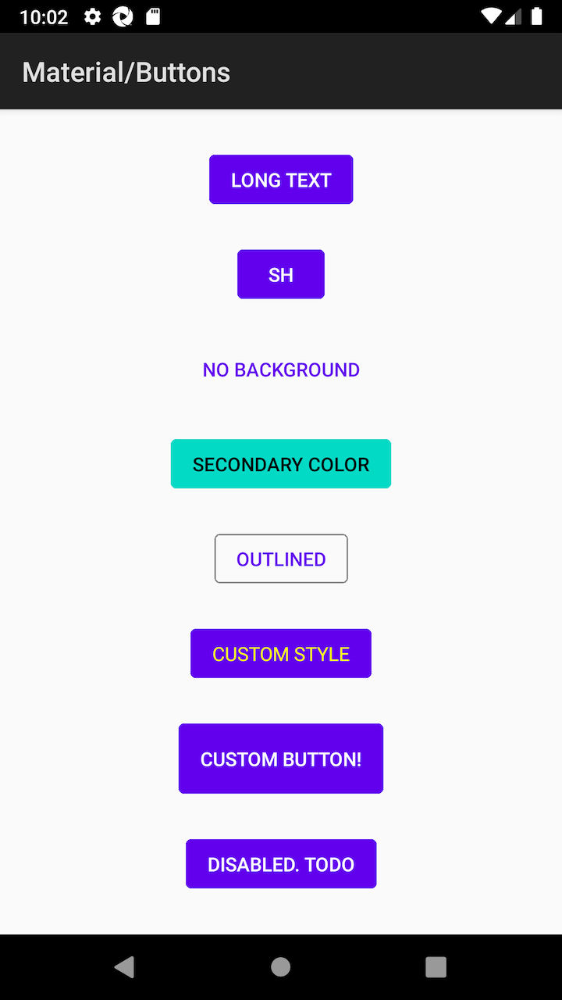

# pagesource-jetpack-compose
This repository is to get page source of [jetpack compose](https://developer.android.com/jetpack/compose) in order to make sure if we can get elements in Espresso/UiAutomator2 layer

```
$ cd frameworks/support/ui/
$ git log #=> b27ac2fe144ac6d6c06098ecfa22f4f2c6095743
$ ./gradlew :ui-demos:assembleDebug
cd ../../../out/dist/ui
```

## Appium caps

```
require 'appium_lib_core'

cap = {
  desired_capabilities: {
    platformName: :android,
    automationName: 'uiautomator2', # or 'espresso'
    app: '/path/to/ui-demos_ui-demos-debug.apk',
    udid: 'emulator-5554',
    deviceName: 'Android Emulator',
    disableWindowAnimation: true,
  },
  appium_lib: {
    wait: 0,
    wait_timeout: 20,
    wait_interval: 1
  }
}

@core = ::Appium::Core.for(cap)
@driver = @core.start_driver

# go to buttons
@driver.page_source # results
```

## Target view

Buttons view




## uiautomator2 Driver
```
<?xml version='1.0' encoding='UTF-8' standalone='yes' ?>
<hierarchy index="0" class="hierarchy" rotation="0" width="1080" height="1794">
  <android.widget.FrameLayout index="0" package="androidx.ui.demos" class="android.widget.FrameLayout" text="" checkable="false" checked="false" clickable="false" enabled="true" focusable="false" focused="false" long-clickable="false" password="false" scrollable="false" selected="false" bounds="[0,0][1080,1794]" displayed="true">
    <android.view.ViewGroup index="0" package="androidx.ui.demos" class="android.view.ViewGroup" text="" resource-id="android:id/decor_content_parent" checkable="false" checked="false" clickable="false" enabled="true" focusable="false" focused="false" long-clickable="false" password="false" scrollable="false" selected="false" bounds="[0,0][1080,1794]" displayed="true">
      <android.widget.FrameLayout index="0" package="androidx.ui.demos" class="android.widget.FrameLayout" text="" resource-id="android:id/action_bar_container" checkable="false" checked="false" clickable="false" enabled="true" focusable="false" focused="false" long-clickable="false" password="false" scrollable="false" selected="false" bounds="[0,63][1080,210]" displayed="true">
        <android.view.ViewGroup index="0" package="androidx.ui.demos" class="android.view.ViewGroup" text="" resource-id="android:id/action_bar" checkable="false" checked="false" clickable="false" enabled="true" focusable="false" focused="false" long-clickable="false" password="false" scrollable="false" selected="false" bounds="[0,63][1080,210]" displayed="true">
          <android.widget.TextView index="0" package="androidx.ui.demos" class="android.widget.TextView" text="Material/Buttons" checkable="false" checked="false" clickable="false" enabled="true" focusable="false" focused="false" long-clickable="false" password="false" scrollable="false" selected="false" bounds="[42,101][443,172]" displayed="true" />
        </android.view.ViewGroup>
      </android.widget.FrameLayout>
      <android.widget.FrameLayout index="1" package="androidx.ui.demos" class="android.widget.FrameLayout" text="" resource-id="android:id/content" checkable="false" checked="false" clickable="false" enabled="true" focusable="false" focused="false" long-clickable="false" password="false" scrollable="false" selected="false" bounds="[0,210][1080,1794]" displayed="true">
        <android.widget.FrameLayout index="0" package="androidx.ui.demos" class="android.widget.FrameLayout" text="" checkable="false" checked="false" clickable="false" enabled="true" focusable="false" focused="false" long-clickable="false" password="false" scrollable="false" selected="false" bounds="[0,210][1080,1794]" displayed="true">
          <android.view.ViewGroup index="0" package="androidx.ui.demos" class="android.view.ViewGroup" text="" checkable="false" checked="false" clickable="false" enabled="true" focusable="true" focused="false" long-clickable="false" password="false" scrollable="false" selected="false" bounds="[0,210][1080,1794]" displayed="true" />
        </android.widget.FrameLayout>
      </android.widget.FrameLayout>
    </android.view.ViewGroup>
  </android.widget.FrameLayout>
</hierarchy>
```

## Espresso Driver
```
<?xml version='1.0' encoding='UTF-8' standalone='yes' ?>
<com.android.internal.policy.DecorView index="0" package="androidx.ui.demos" class="com.android.internal.policy.DecorView" checkable="false" checked="false" clickable="false" enabled="true" focusable="false" focused="false" scrollable="false" long-clickable="false" password="false" selected="false" visible="true" bounds="[0,0][1080,1920]" viewIndex="0">
  <com.android.internal.widget.ActionBarOverlayLayout index="0" package="androidx.ui.demos" class="com.android.internal.widget.ActionBarOverlayLayout" checkable="false" checked="false" clickable="false" enabled="true" focusable="false" focused="false" scrollable="false" long-clickable="false" password="false" selected="false" visible="true" bounds="[0,0][1080,1794]" resource-id="android:id/decor_content_parent" viewIndex="1">
    <android.widget.FrameLayout index="0" package="androidx.ui.demos" class="android.widget.FrameLayout" checkable="false" checked="false" clickable="false" enabled="true" focusable="false" focused="false" scrollable="false" long-clickable="false" password="false" selected="false" visible="true" bounds="[0,210][1080,1794]" resource-id="android:id/content" viewIndex="2">
      <android.widget.FrameLayout index="0" package="androidx.ui.demos" class="android.widget.FrameLayout" checkable="false" checked="false" clickable="false" enabled="true" focusable="false" focused="false" scrollable="false" long-clickable="false" password="false" selected="false" visible="true" bounds="[0,210][1080,1794]" viewIndex="3">
        <androidx.ui.core.AndroidCraneView index="0" package="androidx.ui.demos" class="androidx.ui.core.AndroidCraneView" checkable="false" checked="false" clickable="false" enabled="true" focusable="true" focused="false" scrollable="false" long-clickable="false" password="false" selected="false" visible="true" bounds="[0,210][1080,1794]" viewIndex="4" />
      </android.widget.FrameLayout>
    </android.widget.FrameLayout>
    <com.android.internal.widget.ActionBarContainer index="1" package="androidx.ui.demos" class="com.android.internal.widget.ActionBarContainer" checkable="false" checked="false" clickable="false" enabled="true" focusable="false" focused="false" scrollable="false" long-clickable="false" password="false" selected="false" visible="true" bounds="[0,63][1080,210]" resource-id="android:id/action_bar_container" viewIndex="5">
      <android.widget.Toolbar index="0" package="androidx.ui.demos" class="android.widget.Toolbar" checkable="false" checked="false" clickable="false" enabled="true" focusable="false" focused="false" scrollable="false" long-clickable="false" password="false" selected="false" visible="true" bounds="[0,63][1080,210]" resource-id="android:id/action_bar" viewIndex="6">
        <android.widget.TextView index="0" package="androidx.ui.demos" class="android.widget.TextView" checkable="false" checked="false" clickable="false" enabled="true" focusable="false" focused="false" scrollable="false" long-clickable="false" password="false" selected="false" visible="true" bounds="[42,101][443,172]" text="Material/Buttons" hint="false" viewIndex="7" />
        <android.widget.ActionMenuView index="1" package="androidx.ui.demos" class="android.widget.ActionMenuView" checkable="false" checked="false" clickable="false" enabled="true" focusable="false" focused="false" scrollable="false" long-clickable="false" password="false" selected="false" visible="false" bounds="[1080,63][1080,210]" viewIndex="8" />
      </android.widget.Toolbar>
      <com.android.internal.widget.ActionBarContextView index="1" package="androidx.ui.demos" class="com.android.internal.widget.ActionBarContextView" checkable="false" checked="false" clickable="false" enabled="true" focusable="false" focused="false" scrollable="false" long-clickable="false" password="false" selected="false" visible="false" bounds="[0,63][0,63]" resource-id="android:id/action_context_bar" viewIndex="9" />
    </com.android.internal.widget.ActionBarContainer>
  </com.android.internal.widget.ActionBarOverlayLayout>
  <android.view.View index="1" package="androidx.ui.demos" class="android.view.View" checkable="false" checked="false" clickable="false" enabled="true" focusable="false" focused="false" scrollable="false" long-clickable="false" password="false" selected="false" visible="true" bounds="[0,1794][1080,1920]" resource-id="android:id/navigationBarBackground" viewIndex="10" />
  <android.view.View index="2" package="androidx.ui.demos" class="android.view.View" checkable="false" checked="false" clickable="false" enabled="true" focusable="false" focused="false" scrollable="false" long-clickable="false" password="false" selected="false" visible="true" bounds="[0,0][1080,63]" resource-id="android:id/statusBarBackground" viewIndex="11" />
</com.android.internal.policy.DecorView>
```

## Concusion

UiDevice and Espresso cannot get full hierarchy to detect elements...

Okay, but the feature is really awesome since we can handle elements without XMLs.
While it means we must take care of snapshot testing more to ensure Views.

> Jetpack Compose is currently in an early-exploration, pre-alpha stage.Its API surfaces are not yet finalized and it should not be used for production.

As the compose page addresses, current status is exactly early stage. Looking forward to the evolution.
